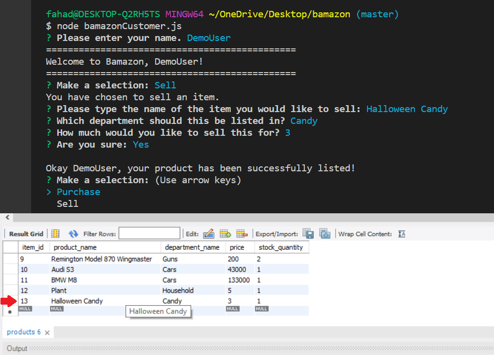

# bamazon


This application is an Am*zon-like storefront using an updating database on MySQL through Node.js. 


The app starts off by asking for your username, which it will frequently use throughout your time shopping on *Bamazon*, for a friendlier experience!


After your name is taken, you are presented with options to **Sell** and **Purchase**.

## Functions

The *bamazon* database has the following categories assigned to all products for sale:
* item_id (unique id for each product)
* product_name (Name of product)
* department_name
* price (cost to customer)
* stock_quantity (how much of the product is available in stores)

## Sell



Selling an item on *bamazon* is as simple as typing in a name for your product, a department name to categorize the listing, and an input for the price.

After confirmation, the listing is made and your product is updated on the MySQL database. You will be redirected back to the main menu after this, where you can purchase!

## Purchase

When buying on *bamazon*, you are presented with a table of items available. You can simply find the listing for what you would like and enter the item number provided. *bamazon* has a built in method to send a request to the database, which responds with how much of the selected product is in stock. In the example below, the Coca Cola's stock reflects the purchase from 8 to 7.


```javascript
function check() {
    connection.query("SELECT stock_quantity FROM products WHERE item_id=" + res.item_id,
        function (err, response) {
        if (err) throw err;
        if (response[0].stock_quantity < 1) {console.log("We are out of stock!");}
        else {console.log("Thank you for your purchase!");
        updatedQ = response[0].stock_quantity -1;
        console.log(updatedQ + " remaining.");
        connection.query("UPDATE products SET ? WHERE ?")}                         
```
The snippet above checks the product inventory and if you attempt to purchase a sold out product, *bamazon* will inform and redirect you to the menu.


*bamazon* will update you with how many products are still in stock. In this case, we have purchased **the last of the Halloween Candy**.


## NPM Dependencies
* Dotenv, to hold databse connection settings
* Inquirer, to take user input
* MySQL, to create and update the database
* Table, to display inventory
